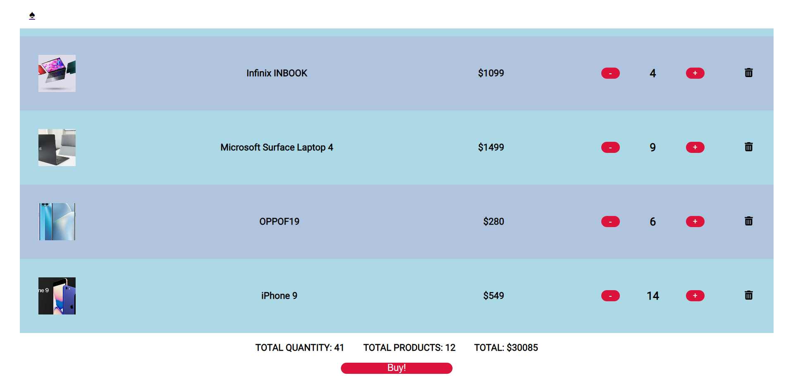

# Shop application

I implemented the functionalities of an online shop application using React JS.
I used [dummyjson.com](https://dummyjson.com/docs/products) to generate the data for the products.
The user/login/cart functionalities use an internal API which can only be accessed at my work place office or through a VPN connection.

You can use these credentials to login and test the application:
- username: test4@mail.com
- password: hl7^cfl6$n0Jll1K2WAp&#o1

This project was bootstrapped with [Create React App](https://github.com/facebook/create-react-app).

## Photos

## Available Scripts

In the project directory, you can run:

### `npm start`

Runs the app in the development mode.\
Open [http://localhost:3000](http://localhost:3000) to view it in your browser.

The page will reload when you make changes.\
You may also see any lint errors in the console.

### `npm run build`

Builds the app for production to the `build` folder.\
It correctly bundles React in production mode and optimizes the build for the best performance.

The build is minified and the filenames include the hashes.\
Your app is ready to be deployed!

See the section about [deployment](https://facebook.github.io/create-react-app/docs/deployment) for more information.

## Learn More

You can learn more in the [Create React App documentation](https://facebook.github.io/create-react-app/docs/getting-started).

To learn React, check out the [React documentation](https://reactjs.org/).

### [Code Splitting](https://facebook.github.io/create-react-app/docs/code-splitting)

### [Analyzing the Bundle Size](https://facebook.github.io/create-react-app/docs/analyzing-the-bundle-size)

### [Making a Progressive Web App](https://facebook.github.io/create-react-app/docs/making-a-progressive-web-app)

### [Advanced Configuration](https://facebook.github.io/create-react-app/docs/advanced-configuration)

### [Deployment](https://facebook.github.io/create-react-app/docs/deployment)

### `npm run build` [fails to minify](https://facebook.github.io/create-react-app/docs/troubleshooting#npm-run-build-fails-to-minify)
